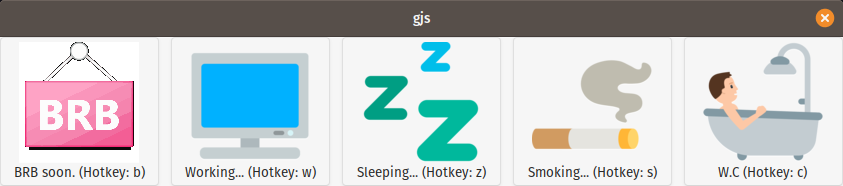
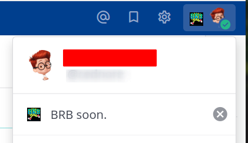

# pendulum

> Update your mattermost status at ease

[](https://releases.ubuntu.com/20.04/)

## 👷 Background

I work in a pretty big team of engineers (> 60 people) in a large office and we use self-hosted mattermost server.
Sometimes I am too far away from my colleagues to be called shouting or sometimes they are too lazy to walk for ~ 10
seconds to my desk and check if I am away or not. They keep me asking 'hey, update your mattermost status when you are
absent', then I am like 'should I make 4 mouse clicks and type ~ 20 characters for every bathroom breaks or being away
to help others? no way'. Maybe I am too lazy as well or it isn't too much compared to my habit to wander all across
the office too often (I normally sit up/down my office chair nearly 40~50 times a day and that's why my nickname is
**pendulum**).

So I have decided to make an automation to help me reduce the fingertips when I am updating my mattermost status. It had
to be simple as enough by pressing a few hotkeys, it had to override my screenlock hotkey (`Super + L`) because there's
a strict company policy reads `You must lock your screen when you are away`. That's the great, historical demand of this
small utility, or a helper program.

> ⚠️ WARNING: Before you dive deeper, I need to warn you this little program was not meant to be production-ready, it was
> only for my personal use (or my colleagues who loves _Ubuntu_). It is not well-tested, only tried manual and
> insufficient testing in `focal`. It might break in other distros, other environemnts, or it doesn't run on **macOS**
> or **Windows**. It might be also buggy, and I am not 100% sure about its reliability. Use it at your own risk.

## ✨ Features

1. Override `Super + L` hotkey, show app window instead

   

2. Pressing a button updates your mattermost status

   

3. Each status button has a hotkey, so that you can accelerate the screenlock process (e.g `Super + L, z` to set
   `Sleeping...`)
4. Timeout in 5 seconds fallback to general away status `BRB soon.`
5. Unlock monitor (which needs be started at login and be kept running), which listens to screen unlock event and update
   the status as `Working...`

> ⚠️ WARNING: This project can only be run on Ubuntu Desktop and its subdistros (e.g Pop!\_OS). Tested only on `focal`.

## 🧱 Prerequisites

1. [GNOME shell](https://wiki.gnome.org/Projects/GnomeShell) `>=3`
2. [gjs](https://gjs.guide/) `>=1.64`
3. [Node.js](https://nodejs.org/) `>=16` (might be able to run on lower versions as well, not tested)
4. [Mattermost](https://mattermost.com/) server `>=6` (with **API** `v4`) and an account in it ofc

## 🎉 Getting started

```bash
# clone from github
git clone git@github.com:cednore/pendulum.git

# cd into repo directory
cd pendulum

# generate a new dotenv file
cp .env.example .env # customize with your own settings after this

# install npm dependencies
npm install

# start main window
npm start

# start unlock monitor
npm run unlock-monitor
```

## 🚚 Installation

1. Git clone this repo somewhere you like it
2. Prepare `.env` file inside the directory and customize your mattermost server url, username and password
3. `npm install` inside the directory
4. Override `Super + L` hotkey with [start.sh](start.sh) script
5. Add [unlockmonitor.sh](unlockmonitor.sh) to startup application

## 🚧 Roadmap

- [ ] More status presets
- [ ] Set expiration of custom status (not found in mattermost api doc, is it possible?)
- [ ] Darken rest of the screen except the main screen
- [ ] Single JS bundle file by webpack
- [ ] Easy installation script, available directly from github
- [ ] GitHub action powered release pipeline
- [ ] Extend to Slack
- [ ] Add markdown badges for _Mattermost_, _GNOME_, _GJS_

## 📄 License

This project is licensed under the **MIT License**.

## 🙇 Credits

- Credit to [@mattermost Team](https://github.com/mattermost) for building such a powerful team collaboration app (also
  made it self-hostable 🤗).
- Special thanks to those behind [gjs](https://gjs.guide/), you made my life easier 💪
- Thanks to my colleagues, who were too lazy to call me shouting, prefered checking mattermost status for my absence 🦥
